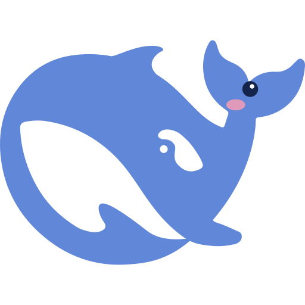

# 鲸鱼桌宠 v2（Whale Desktop Pet v2）

<p align="center">
  
</p>

一只游在网页上的**小鲸鱼桌宠**：住在右下角的池塘里，会喷水、吃小鱼、跟着你的鼠标绕圈圈，还会根据 Agent 的工作状态说不同的台词、发出不同的声音。

v2 在 v1 的基础上新增：**池塘与随机游动的小鱼、鲸鱼喷水、饥饿觅食、点击后变小绕圈、正确的鱼类游动姿态**，并且悬浮层级压过所有对话框。

> 鲸鱼造型源自 DeepSeek 网页端「探索未至之境」旁边的鲸鱼图案（其 SVG 路径数据）。

---

## ✨ 功能

| 功能 | 说明 |
| --- | --- |
| 🐳 自由游动 | 平时在池塘附近随机游动，偶尔游遍整个页面 |
| 🐟 池塘与小鱼 | 右下角池塘，随机生成小鱼，小鱼会自然游动、寿终消失 |
| 🍽️ 饥饿觅食 | 小鲸会饿（饥饿值增长），饿了就游向最近的小鱼吃掉，吃完喷水庆祝 |
| 💦 喷水 | 每隔一会儿随机喷水，水柱和水滴有完整动画 |
| 🖱️ 点击绕圈 | 点击页面任意位置，小鲸快速游过去 → 变小 → 围着点击处绕一圈 → 恢复 |
| 💬 气泡台词 | 每种事件都有对应台词：开工、收工、报错、用户消息、各工具、批准等 |
| 🔊 Web Audio 音效 | 纯代码合成音效：开工、收工、点击、绕圈、进食、喷水、鲸歌……零音频文件 |
| 🤖 Agent 状态联动 | 实时感知 Agent 忙碌/空闲/出错/请求批准，切换动作、台词和音效 |
| 🎨 零依赖 | 纯原生 JS + SVG + CSS 动画 + Web Audio，无任何第三方库 |

---

## 🚀 快速开始

### 方式一：独立演示版（最简单）

直接用浏览器打开 [`demo/index.html`](demo/index.html) 即可。演示页内置了模拟事件面板，可以手动触发「开工 / 收工 / 报错 / 工具调用 / 批准」等事件，观察小鲸的反应。

> 演示版与原版插件共用同一份源码：仅把 DSH 的 `ctx` / `host` 接口替换成了本地垫片（shim），其余代码一字未改。

### 方式二：作为 DeepSeek Harness 插件安装

本插件以 **Cordis 插件**形式运行在 DeepSeek Harness（本地 AI 助手 Web 环境）中。

1. 打开 DeepSeek Harness Web 界面，找到插件定义（`cordis_define`）入口；
2. 将 [`plugin/whale-pet-v2.define.json`](plugin/whale-pet-v2.define.json) 中的内容作为定义提交；
3. 运行插件（`cordis_run`），小鲸即出现在页面中。

源码拆分说明：

- [`plugin/client.js`](plugin/client.js) —— 客户端（浏览器端）插件源码，桌宠的全部视觉与行为逻辑；
- [`plugin/host.js`](plugin/host.js) —— 宿主端插件源码，采集 Agent 状态与事件（忙碌/空闲/出错/消息/工具/批准），供客户端轮询；
- [`plugin/whale-pet-v2.define.json`](plugin/whale-pet-v2.define.json) —— 完整插件定义载荷，可直接用于 `cordis_define`。

---

## 📁 目录结构

```
whale-desktop-pet-v2/
├── assets/
│   ├── whale.svg            # 鲸鱼矢量徽标（与插件内 SVG 同源）
│   └── whale.png            # README 展示图
├── demo/
│   └── index.html           # 独立演示版（双击即可运行）
├── plugin/
│   ├── client.js            # 客户端插件源码（原样）
│   ├── host.js              # 宿主端插件源码（原样）
│   └── whale-pet-v2.define.json  # 完整 cordis_define 定义载荷
├── LICENSE
└── README.md
```

---

## 🔧 技术要点

- **动画**：全部使用 CSS `@keyframes`（上下浮动、游动摇摆、眨眼、水柱、水滴、涟漪、小鱼摆尾）；
- **移动**：通过 `left/top` + `cubic-bezier` 过渡实现平滑游动，根据距离计算游动速度与方向翻转；
- **音效**：Web Audio API 的振荡器（oscillator）+ 增益包络实时合成，无需任何音频素材；
- **通信**：客户端每 700ms 轮询 `host` 的 `pet/poll` 接口获取事件快照，事件驱动台词与动作；
- **健壮性**：所有定时器统一托管，插件卸载时完整清理；音频不可用、离线等异常全部静默降级。

---

## 📜 许可证

[MIT](LICENSE) © 2026 Whale Desktop Pet v2 Contributors

## 🙏 致谢

- 鲸鱼造型：DeepSeek 网页端「探索未至之境」旁的鲸鱼图案；
- 运行平台：DeepSeek Harness（Cordis 插件体系）。
